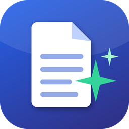

# DOCX.AI



[](https://github.com/motthz/DOCX.AI/actions/workflows/ci.yml)
[](https://github.com/motthz/DOCX.AI/releases/latest)

Applicazione desktop per Windows 10/11 (x64) che compila **qualsiasi modulo Word o Excel**
(rapporti, verbali, richieste, schede, checklist, offerte, moduli amministrativi…) a partire
da informazioni scritte a parole tue. L'AI gira **in locale e offline** (llama.cpp + Qwen3):
i dati non lasciano mai il PC. Ogni bozza viene **sempre revisionata e approvata**
dall'utente prima dell'esportazione.

> Fino alla versione 0.3 l'app si chiamava *MaintenanceAI*: aggiornando, dati e moduli
> vengono migrati automaticamente.


## Installazione

1. Scarica **`DOCX.AI-Setup-<versione>.exe`** dalla pagina
   [Releases](https://github.com/motthz/DOCX.AI/releases/latest) e avvialo
   (non servono diritti di amministratore).
2. Scegli il modello AI da scaricare al primo avvio (o "non ora").
3. Avvia **DOCX.AI** dal collegamento sul Desktop.

> Windows SmartScreen può mostrare "PC protetto da Windows" perché l'installer non è
> firmato digitalmente: *Ulteriori informazioni → Esegui comunque*.
> Se un antivirus blocca l'app vedi [Antivirus e SmartScreen](docs/distribuzione-aziendale.md#antivirus-e-smartscreen).

Disponibile anche lo ZIP **portable**. Per la distribuzione in azienda (Intune, GPO,
installazione silenziosa) vedi [docs/distribuzione-aziendale.md](docs/distribuzione-aziendale.md).

## Funzioni principali

- **Qualsiasi modulo**: l'AI compila i campi `{{...}}` del tuo modello DOCX/XLSX partendo dal tuo
  testo (o da altri documenti e scansioni); immagini incluse nel PDF. Esempi pronti: verbale di
  riunione, richiesta d'acquisto, rapporto di intervento.
- **Revisione affiancata alle fonti** con evidenza dei valori non presenti nel testo fornito
  (anti-allucinazione), "migliora testo" e salvataggio automatico.
- **Export** PDF + DOCX/XLSX compilato + JSON; anteprima PDF, stampa, email.
- **Storico** con ricerca globale, filtri su qualsiasi campo, duplicazione, versioni, export Excel,
  import da CSV/Excel.
- **Documenti AI**: creazione, modifica, audit, compilazione da documenti, OCR delle scansioni.
- **Editor visuale del template**, regole AI per funzione e per modulo.
- **Backup/ripristino**, cartella dati anche di rete, tema chiaro/scuro, italiano/inglese.
- **AI locale**: GPU Vulkan opzionale, ricerca semantica, controllo RAM, spegnimento per inattività.

Guida completa: [docs/guida-utente.md](docs/guida-utente.md) ·
[English user guide](docs/user-guide.md) (anche dentro l'app con `F1`).

## Requisiti

| | Minimo | Consigliato |
|---|---|---|
| Sistema | Windows 10 22H2 x64 | Windows 11 |
| RAM | 4 GB (senza AI o modello 0.6B) | 8 GB (modello 1.7B), 12–16 GB (modello 4B, più preciso) |
| Disco | 300 MB + 0,7–2 GB per l'AI | SSD |
| GPU | non necessaria | scheda con driver Vulkan |
| Internet | solo per scaricare l'AI una volta | |

## Sviluppo

Prerequisito: Python 3.12 x64. Tieni il repository **fuori da OneDrive/Dropbox**.

```powershell
powershell -ExecutionPolicy Bypass -File scripts\setup_dev.ps1   # venv, dipendenze con hash, pre-commit
powershell -ExecutionPolicy Bypass -File scripts\run_dev.ps1     # avvia la GUI
powershell -ExecutionPolicy Bypass -File scripts\test.ps1        # unit test + self-test + copertura
.venv\Scripts\python.exe scripts\smoke_gui.py                     # smoke test GUI (--dark, --lang en-US, --shots DIR)
powershell -ExecutionPolicy Bypass -File scripts\release.ps1     # exe, ZIP portable e installer in release\
```

Il rilascio è automatico: aggiorna `__version__` in `src/docx_ai/__init__.py` e il
`CHANGELOG.md`, poi `git tag vX.Y.Z && git push --tags`. Dettagli in [CONTRIBUTING.md](CONTRIBUTING.md).

```
src/docx_ai/
  ui/            interfaccia (shell, pagine, dialoghi, design system, traduzioni)
  llm/           llama.cpp, Ollama, pipeline JSON, grounding, embedding, hardware, installer AI
  services/      documenti compilati, contesto, impostazioni, backup, import, diagnostica, pulizia
  docintelligence/  creazione/modifica/audit documenti, OCR, regole AI
  exporters/     PDF, DOCX, XLSX, riepilogo Excel
  locales/       catalogo inglese
tests/           unit test (inclusa migrazione di un DB della v0.1.0)
packaging/       PyInstaller, installer Inno Setup, icone, licenze, versione
docs/            guida utente IT/EN, distribuzione aziendale
```

## Licenza

Software proprietario, tutti i diritti riservati: vedi [LICENSE](LICENSE). I componenti di
terze parti mantengono le proprie licenze ([LICENSES/](LICENSES/README.txt)).
