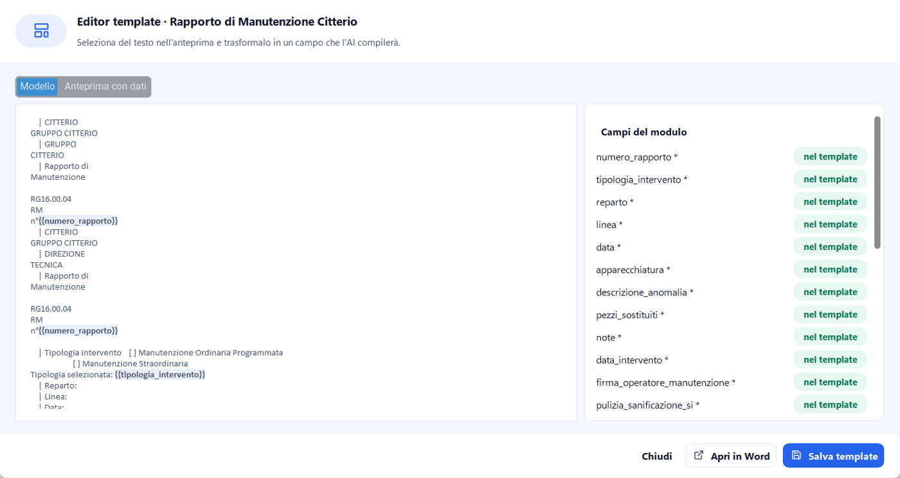
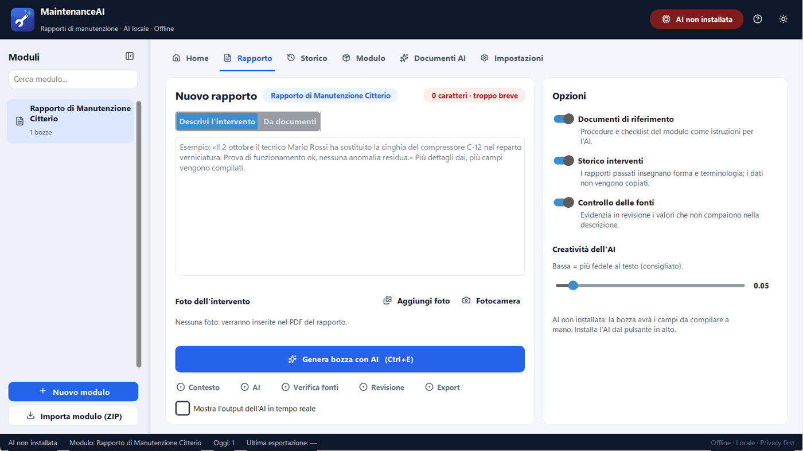
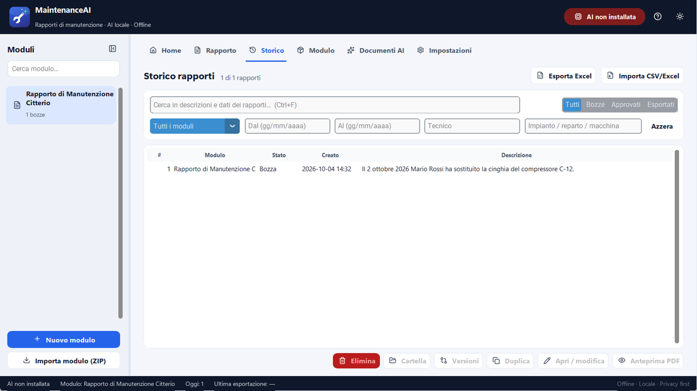
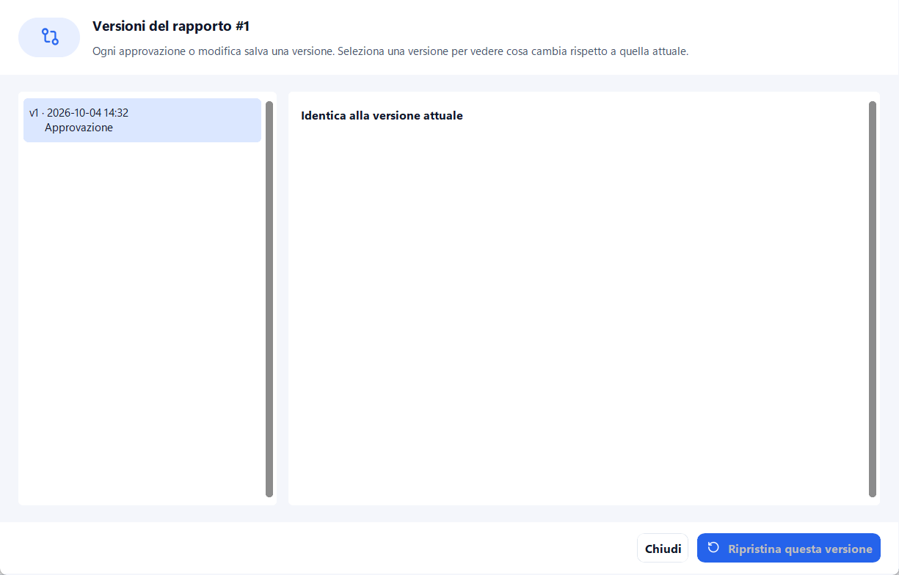
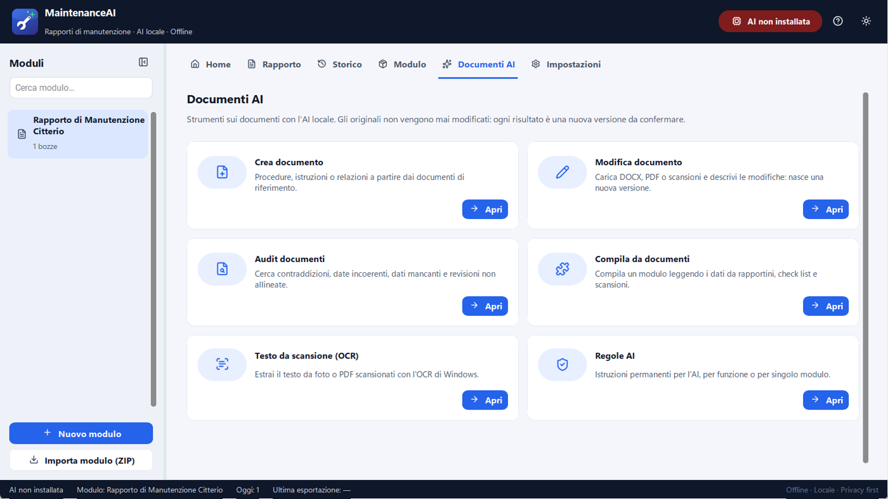
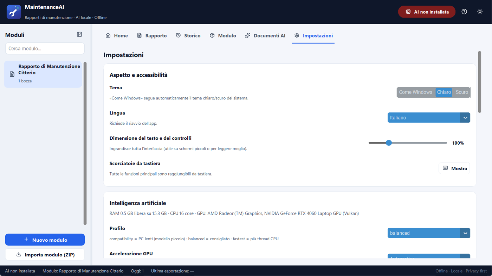
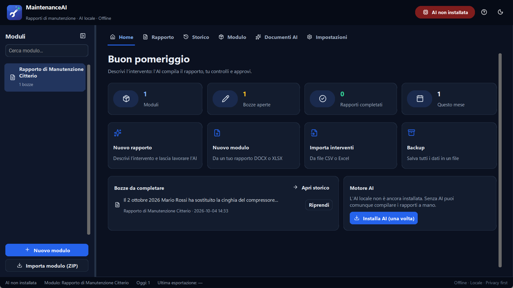
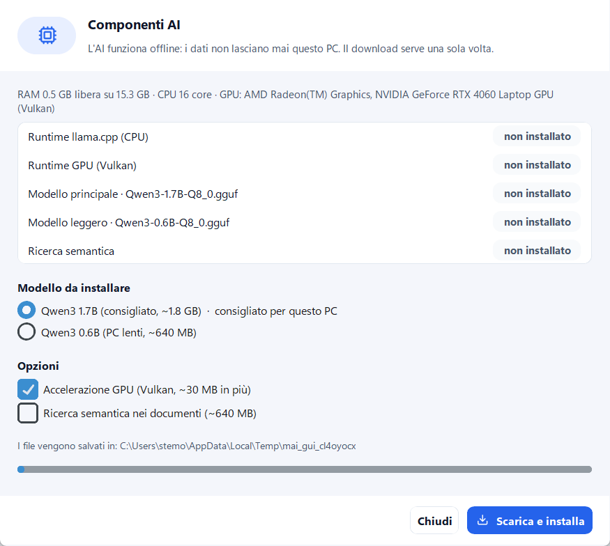

# Guida all'uso di MaintenanceAI

MaintenanceAI compila i rapporti di manutenzione a partire da una descrizione scritta
a parole tue. L'intelligenza artificiale gira **sul tuo PC**: nessun dato viene inviato
in Internet. Ogni rapporto viene sempre **controllato e approvato da te** prima di
essere esportato.

## 1. Primi passi

1. **Installa** l'app con `MaintenanceAI-Setup.exe`: non servono diritti di amministratore.
   Sul Desktop compare il collegamento *MaintenanceAI*.
2. Al primo avvio una breve procedura guidata chiede lingua e cartella dei dati.
3. **Installa il motore AI** (una volta sola, ~2 GB): clicca su *AI non installata*
   in alto a destra, oppure lascia che lo faccia l'app se l'hai scelto nell'installer.
   Da quel momento l'AI funziona anche senza Internet.
4. Segui il **tour guidato** che presenta le funzioni principali (lo puoi rivedere da
   *Impostazioni → Aiuto e supporto*).

> Senza AI installata l'app funziona lo stesso: la bozza ha i campi vuoti da compilare
> a mano nella revisione.

## 2. Moduli

Un **modulo** è il modello del rapporto: un tuo file Word (DOCX) o Excel (XLSX) in cui
i punti da compilare sono scritti come `{{nome_campo}}`, per esempio
`Data intervento: {{data_intervento}}`.

- **Nuovo modulo** (barra laterale o `Ctrl+N`): scegli *Da un mio file* e seleziona il
  DOCX/XLSX. Campi e mappatura vengono creati da soli.
- **Editor template** (scheda *Modulo*): seleziona un testo nell'anteprima del
  documento e trasformalo in un campo, senza aprire Word né scrivere JSON.

  

- **Documenti di riferimento**: procedure, checklist, manuali (anche PDF e scansioni)
  nella cartella *Documenti di riferimento* del modulo. L'AI li usa come istruzioni,
  mai come prova di attività eseguite.
- **Regole AI del modulo**: istruzioni permanenti (es. "usa sempre il codice macchina
  completo"). L'AI le legge ma non può modificarle.

## 3. Creare un rapporto

1. Seleziona il modulo nella barra laterale e apri la scheda **Rapporto**.
2. Descrivi l'intervento: data, impianto, macchina, componenti, attività, esito,
   tecnico. Più dettagli dai, più campi vengono compilati. Puoi anche:
   - **aggiungere foto** (o aprire la *Fotocamera* di Windows): finiscono nel PDF;
   - passare a **Da documenti** per compilare leggendo rapportini, checklist o scansioni.
3. Premi **Genera bozza con AI** (`Ctrl+E`). Le fasi (Contesto → AI → Verifica fonti →
   Revisione → Export) sono mostrate sotto il pulsante; con *Mostra l'output dell'AI in
   tempo reale* vedi il testo mentre viene generato.

### Opzioni

| Opzione | Effetto |
|---|---|
| Documenti di riferimento | Procedure e checklist del modulo come istruzioni per l'AI |
| Storico interventi | I rapporti passati insegnano forma e terminologia (i dati non vengono copiati) |
| Controllo delle fonti | In revisione evidenzia i valori che non compaiono nella descrizione |
| Creatività dell'AI | Bassa = più fedele al testo (consigliato) |

## 4. Revisione e approvazione

La revisione mostra **a sinistra le fonti** (la tua descrizione e i documenti) e
**a destra i campi**. Cliccando un campo, il suo valore viene evidenziato nelle fonti.

Ogni campo ha un'etichetta:

- **Trovato nelle fonti**: il valore compare nella descrizione o nei documenti.
- **Da verificare** (rosso): numeri, codici, date o nomi che **non** compaiono nelle
  fonti, cioè probabili invenzioni dell'AI. Controllali sempre.
- **Dedotto**: valore scelto da un elenco o sì/no, non verificabile parola per parola.
- **Mancante**: campo vuoto o `NON_SPECIFICATO`.

Sui testi lunghi il pulsante **Migliora testo** riscrive la frase in forma tecnica
senza aggiungere fatti (puoi annullare). La bozza viene **salvata automaticamente**
ogni 20 secondi: se chiudi, la ritrovi in *Home → Bozze da completare*.

**Approva e genera il rapporto** produce nella cartella di esportazione:

- `*.pdf`: il rapporto impaginato, con le foto;
- `*.docx` / `*.xlsx`: il tuo modello compilato;
- `*.json`: i dati approvati (fonte ufficiale).

Dalla finestra finale puoi aprire l'**anteprima PDF**, stampare o preparare
un'**email** con il rapporto.

## 5. Storico

- **Ricerca globale** (`Ctrl+F`) su descrizioni e dati dei rapporti.
- **Filtri** per stato, modulo, periodo (*gg/mm/aaaa*), tecnico e impianto/reparto/macchina.
- **Azioni** sui rapporti selezionati (anche con il tasto destro): anteprima PDF,
  apri/modifica, **duplica** (base per un intervento simile), **versioni**, cartella, elimina.
- **Esporta Excel**: riepilogo dei rapporti filtrati, un rapporto per riga.
- **Importa CSV/Excel**: trasforma ogni riga di un foglio in un rapporto, associando
  le colonne ai campi del modulo.

### Versioni

Ogni approvazione o modifica successiva salva una **versione**. La finestra *Versioni*
mostra cosa cambia rispetto alla versione attuale e permette di ripristinarla.

## 6. Documenti AI

| Strumento | A cosa serve |
|---|---|
| Crea documento | Procedure, istruzioni o relazioni a partire dai documenti di riferimento |
| Modifica documento | Nuova versione di un DOCX/PDF/scansione secondo le tue richieste |
| Audit documenti | Contraddizioni, date incoerenti, dati mancanti, revisioni non allineate |
| Compila da documenti | Compila un modulo leggendo rapportini, checklist, scansioni |
| Testo da scansione (OCR) | Estrae il testo da foto e PDF scansionati con l'OCR di Windows |
| Regole AI | Istruzioni permanenti per funzione o per modulo |

Gli originali non vengono mai modificati: ogni risultato è una nuova versione.

## 7. Impostazioni

- **Aspetto**: tema chiaro, scuro o *come Windows*; lingua (italiano/inglese);
  **dimensione del testo** (80–160%).

  

- **Intelligenza artificiale**: profilo (*compatibility* per PC lenti, *balanced*
  consigliato, *fastest*), **accelerazione GPU** (schede con driver Vulkan),
  precaricamento all'avvio, spegnimento dopo inattività (libera RAM), thread CPU,
  contesto, **ricerca semantica** nei documenti, controllo delle fonti.
- **Dati e backup**: cartella dati (anche **di rete**: un blocco impedisce l'uso
  contemporaneo da due PC), **backup** in un file ZIP, **ripristino**, backup automatico.
- **Aiuto e supporto**: questa guida, tour guidato, **pacchetto diagnostico** (log
  senza rapporti né documenti) e **segnalazione di un problema**.

## 8. Scorciatoie da tastiera

| Tasti | Azione |
|---|---|
| `Ctrl+1` … `Ctrl+6` | Home, Rapporto, Storico, Modulo, Documenti AI, Impostazioni |
| `Ctrl+Tab` / `Ctrl+Shift+Tab` | Scheda successiva / precedente |
| `Ctrl+N` | Nuovo modulo |
| `Ctrl+E` | Genera la bozza del rapporto |
| `Ctrl+F` | Cerca nello storico |
| `Ctrl+B` | Mostra/nascondi la barra laterale |
| `Ctrl+,` | Impostazioni |
| `F1` | Guida |
| `F5` | Ricarica i moduli |
| `Esc` | Chiude la finestra di dialogo |
| `Canc` | Elimina i rapporti selezionati (Storico) |

## 9. Domande frequenti

**L'AI inventa dei dati?** Le regole interne le vietano di inventare date, nomi, codici
e numeri, e il *controllo delle fonti* evidenzia in rosso i valori che non compaiono nelle
fonti. Il modello leggero (0.6B) sbaglia più spesso: con almeno 6 GB di RAM usa l'1.7B.

**Serve Internet?** Solo per scaricare una volta i componenti AI. Tutto il resto è offline.

**L'AI è lenta.** Usa il profilo *compatibility*, attiva la GPU se disponibile, chiudi i
programmi che occupano RAM. Con *Precarica il modello all'avvio* la prima bozza è più rapida.

**Dove sono i miei dati?** In `%LOCALAPPDATA%\MaintenanceAI` (o nella cartella scelta in
*Impostazioni → Dati*). Fai un **backup** periodico; quello automatico è settimanale.

**Posso usare l'app da più PC?** Sì, con una cartella dati di rete. Lo stesso archivio
non va però aperto da due PC contemporaneamente: l'app avvisa se succede.

**Windows mostra "PC protetto da Windows".** L'installer non è firmato digitalmente:
clicca *Ulteriori informazioni → Esegui comunque*.

**Qualcosa non funziona.** *Impostazioni → Aiuto e supporto → Segnala un problema* crea
il pacchetto diagnostico sul Desktop e apre la pagina di segnalazione.
