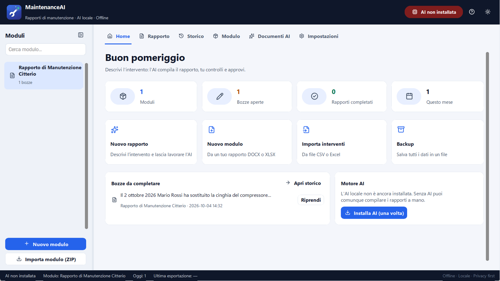
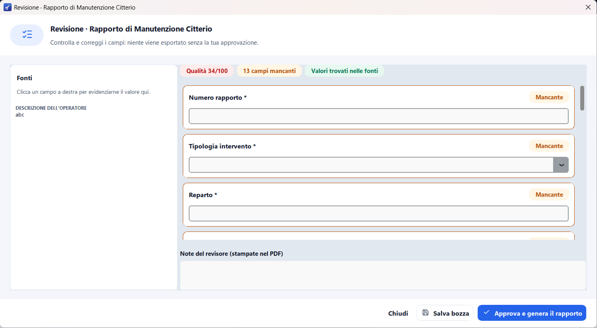

# DOCX.AI user guide

DOCX.AI fills in **any Word or Excel form** (reports, minutes, requests, data sheets,
checklists, quotes, administrative forms…) starting from information written in your
own words. The AI runs **on your PC**: no data is sent to the Internet. Every document
is always **checked and approved by you** before it is exported.

## 1. Getting started

1. **Install** the app with `DOCX.AI-Setup.exe`: no administrator rights needed.
   A *DOCX.AI* shortcut appears on the Desktop.
2. On first launch a short wizard asks for the language and the data folder.
3. **Install the AI engine** (only once, 0.7–2 GB): click *AI not installed* at the top
   right, or let the app do it if you chose a model in the installer.
4. Follow the **guided tour** (replay it from *Settings → Help and support*).

> Without the AI the app still works: fill in the fields manually during review.

> Upgrading from MaintenanceAI: your modules, documents and settings are moved to
> DOCX.AI automatically on first launch.

## 2. Modules

A **module** is the document template: a Word (DOCX) or Excel (XLSX) file of yours where
the parts to fill in are written as `{{field_name}}`, e.g. `Customer: {{customer}}`.

- **New module** (sidebar or `Ctrl+N`): choose *From my own file*. Fields and mapping are
  created automatically. Set the **document type** (e.g. "meeting minutes", "purchase
  request"): the AI uses it as context.
- **Template editor** (*Module* tab): select text in the preview and turn it into a field.
- **Reference documents**: price lists, procedures, contracts, manuals (PDF and scans too)
  used by the AI as instructions and context, never as facts of the current document.
- **Module AI rules**: permanent instructions the AI reads but cannot change.

Ready-made examples in `examples/modules`: *Meeting minutes* (DOCX), *Purchase request*
(XLSX) and a technical job report.

## 3. Filling in a document

1. Select the module in the sidebar and open the **Fill in** tab.
2. Write the information in your own words: who, what, when, where, amounts, decisions,
   outcomes. You can also add **photos/images** or switch to **From documents** to read
   data from other files, tables or scans.
3. Press **Fill in with AI** (`Ctrl+E`). The phases are shown below the button; *Show the
   AI output in real time* displays the text while it is generated.

## 4. Review and approval

The review shows **the sources on the left** and **the fields on the right**:

- **Found in the sources**: the value appears in your text or the documents.
- **To check** (red): numbers, codes, dates, amounts or names **not** found in the
  sources — likely invented by the AI. Always check them.
- **Inferred**: chosen from a list or yes/no. **Missing**: empty or `NON_SPECIFICATO`.

**Improve text** rewrites long texts clearly without adding facts. Drafts are **saved
automatically** every 20 seconds. **Approve and generate the document** produces a PDF
(with images), your template filled in (DOCX/XLSX) and the approved data (JSON).

## 5. History

- **Global search** (`Ctrl+F`) across all filled-in documents.
- **Filters** by status, module, period and **any module field** (e.g. *Customer = ACME*).
- **Duplicate**, **versions** (compare and restore), PDF preview, delete.
- **Export to Excel** and **Import from table** (each CSV/Excel row becomes a document).

## 6. AI documents

Create documents, edit documents (new version), audit documents, fill in a module from
other documents, extract text from scans (Windows OCR), AI rules. Originals are never changed.

## 7. Settings

- **Appearance**: light, dark or *like Windows* theme; language; **text size** (80–160%).
- **Artificial intelligence**: profile, **GPU acceleration** (Vulkan), preload, turn off
  when idle, CPU threads, context, **semantic search**, source check.
- **Data and backup**: data folder (also **on the network**), **backup**, **restore**,
  automatic backup.
- **Help and support**: this guide, guided tour, **diagnostic package**, **report a problem**.
- **About**: version and **automatic updates**: on startup DOCX.AI checks GitHub for a new
  version, downloads it in the background and installs it when you close the app (or right
  away with *Restart and update*). The portable ZIP only shows a notice.

## 8. Keyboard shortcuts

| Keys | Action |
|---|---|
| `Ctrl+1` … `Ctrl+6` | Home, Fill in, History, Module, AI documents, Settings |
| `Ctrl+Tab` / `Ctrl+Shift+Tab` | Next / previous tab |
| `Ctrl+N` | New module |
| `Ctrl+E` | Fill in with AI |
| `Ctrl+F` | Search the history |
| `Ctrl+B` | Show/hide the sidebar |
| `Ctrl+,` | Settings |
| `F1` | Guide |
| `F5` | Reload modules |
| `Esc` | Close the dialog |
| `Del` | Delete the selected documents (History) |

## 9. FAQ

**Does it work with my forms?** Yes, with any DOCX or XLSX: mark the parts to fill in
with `{{field_name}}` (or use the template editor).

**Does the AI invent data?** Built-in rules forbid it and the *source check* highlights
in red the values not found in the sources. Smaller models make more mistakes: with at least 10 GB of RAM install **Qwen3 4B** (Settings → AI components); the app automatically uses the most accurate installed model that fits in free memory.

**Is Internet required?** Only to download the AI components once.

**Where is my data?** In `%LOCALAPPDATA%\DOCX.AI` (or the folder chosen in *Settings → Data*).

**Windows shows "Windows protected your PC".** The installer is not signed: click
*More info → Run anyway*.
